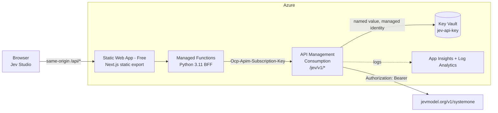

# Jev on APIM — evaluate the Jev System One model behind Azure API Management

[](https://github.com/frkim/jev-on-apim/actions/workflows/ci.yml)
[](https://github.com/frkim/jev-on-apim/actions/workflows/deploy.yml)
[](https://github.com/frkim/jev-on-apim/actions/workflows/codeql.yml)

This sample puts **Azure API Management** in front of the [Jev](https://jevmodel.org) *System One* decision
model. **Jev Studio** is its web front end, where you can evaluate the model interactively. In Jev Studio you can:

- pick a model version (`jev-latest`, `jev-preview`, `jev-1.13.0`), a timeout and other parameters;
- describe a **state** (the context the model reasons about);
- define typed **questions**:
  - `noul` returns yes/no/unknown probabilities;
  - `choice` returns a probability for each option;
  - `score` returns a numeric score;
- load 12 **smart samples**: support triage, jailbreak detection, content moderation, RAG relevance,
  claim verification, agent tool routing, lead qualification, review sentiment, entity dedup,
  pull-request risk, phishing detection and confidence-gated refund routing. Each sample includes
  labelled test cases so you can measure accuracy;
- inspect the results as probability bars, coverage charts and raw JSON. Latency, the APIM request ID and the correlation ID are shown for each call;
- keep a local **history** of runs and replay or compare them.

## Architecture



| Component | SKU | Why |
| --- | --- | --- |
| API Management | **Consumption** | Pay per call; 1M calls/month free |
| Static Web Apps | **Free** | Hosting plus managed Functions at no cost |
| Key Vault | Standard (RBAC) | Pay per operation (cents) |
| Log Analytics + App Insights | PerGB2018, 0.1 GB/day cap | Stays within the free 5 GB/month |
| Managed identity | — | Free |

The expected cost at sample scale is **≈ $0/month** in Azure, plus Jev usage at $0.042 per 1M input tokens.

### Request flow

1. The browser sends `POST /api/systemone` with `{model, state, questions}`.
2. The Functions BFF validates the request (pydantic, 256 KB limit), assigns an `x-correlation-id`, and forwards it to
   `{APIM}/jev/v1/systemone` with the APIM subscription key.
3. APIM rate-limits the call (60/min), removes the subscription key, and injects `Authorization: Bearer {{jev-api-key}}`
   from Key Vault. It retries on 429/503/529 and returns `x-apim-request-id` and `x-gateway-elapsed-ms`.
4. The BFF wraps the response as `{result, meta:{correlationId, latencyMs, upstreamStatus, apimRequestId, gateway}}`.

APIM also exposes `GET /jev/v1/health`, which is answered by APIM itself and never calls Jev.

## Repository layout

```text
src/web      Next.js 15 + MUI (static export)  → Jev Studio UI
src/api      Python 3.11 Azure Functions         → /api/health, /api/models, /api/systemone
infra        Bicep: main.bicep + modules/ (monitoring, keyvault, apim, staticwebapp) + policies/
.github      CI, Deploy, CodeQL workflows, Dependabot, Copilot instructions
docs/adr     Architecture decision records
```

## Deploy with GitHub Actions

1. Configure these **repository secrets and variables**:

   | Name | Type | Value |
   | --- | --- | --- |
   | `AZURE_CREDENTIALS` | secret | Service principal JSON (`clientId`, `clientSecret`, `subscriptionId`, `tenantId`) with Owner or Contributor + User Access Administrator on the subscription |
   | `JEV_API_KEY` | secret | Your Jev API key |
   | `APIM_PUBLISHER_EMAIL` | variable | APIM publisher email |

2. Push to `main`, or run **Deploy** manually from the Actions tab. The workflow:
   - runs CI (lint, tests, Bicep build);
   - deploys the infrastructure (idempotent, with retries);
   - builds the web app and deploys it to SWA together with the Functions API;
   - smoke-tests `/api/health`, `/api/models` and a real `/api/systemone` call through APIM.

   Region: resources go to `swedencentral` and SWA to `eastus2` (westeurope is blocked for this subscription). Change `LOCATION` / `AZURE_LOCATION` in
   `.github/workflows/deploy.yml` if needed.

## Deploy manually

```powershell
az login
az group create -n rg-jevapim-dev-sdc -l swedencentral
$env:APIM_PUBLISHER_EMAIL = "you@example.com"
$env:JEV_API_KEY = "<your key>"
az deployment group create -g rg-jevapim-dev-sdc --parameters infra/main.bicepparam

# Build the web app and deploy it together with the API
cd src/web; npm ci; npm run build; cd ../..
$token = az staticwebapp secrets list -n <swaName> -g rg-jevapim-dev-sdc --query properties.apiKey -o tsv
npx @azure/static-web-apps-cli deploy src/web/out --api-location src/api --api-language python --api-version 3.11 --deployment-token $token --env production
```

## Run locally

See [CONTRIBUTING.md](CONTRIBUTING.md#local-development). The API defaults to **mock mode**, so the UI works
without Azure or a Jev key.

## Call APIM directly

```bash
curl -s https://<apim>.azure-api.net/jev/v1/systemone \
  -H "Ocp-Apim-Subscription-Key: <key>" -H "Content-Type: application/json" \
  -d '{"model":"jev-latest","state":"Customer writes: my card was charged twice and I want a refund now!",
       "questions":{"refund":{"type":"noul","instructions":"Is the customer asking for a refund?"},
                    "urgency":{"type":"choice","instructions":"How urgent is this?","criteria":["low","medium","high"]}}}'
```

## Security

The Jev key is stored only in Key Vault and APIM, and no key ever reaches the browser. See
[SECURITY.md](SECURITY.md) for the full list of controls and the rotation procedure.

## Engineering standards

This repo follows [frkim/ai-coding-standards](https://github.com/frkim/ai-coding-standards). See
[AGENTS.md](AGENTS.md) and [`.github/copilot-instructions.md`](.github/copilot-instructions.md).

## License

[MIT](LICENSE)
